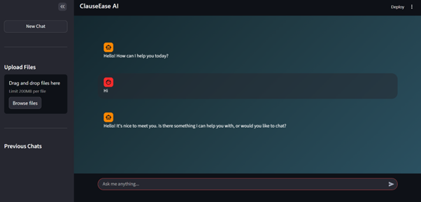
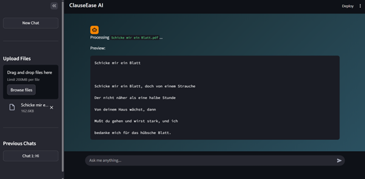
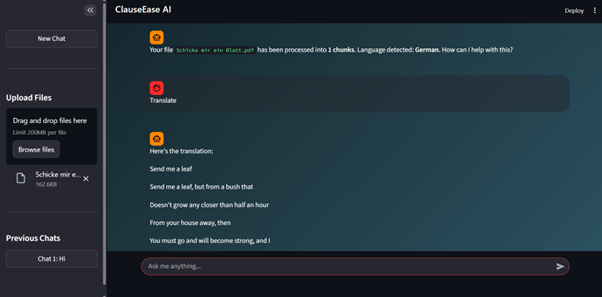

# ClauseEase AI

ClauseEase AI is a local, privacy-preserving document assistant developed as part of the Infosys Springboard Virtual Internship.
It processes PDF and text files, extracts and chunks content, detects language, and performs summarization, translation, and document-based question answering all running fully offline.
The system uses a custom Streamlit UI and the LLaMA 3 model served locally through Ollama, ensuring that no data leaves the user’s device and enabling secure handling of sensitive legal documents.

The assistant supports:

- High-speed PDF extraction with PyMuPDF  
- Automatic language detection using `langdetect`  
- Chunking of long documents for effective context handling  
- Real-time token streaming from a locally hosted LLM  
- Document-grounded summarization, translation, and Q&A  

<p align="center">

</p>

## 1. Overview

This project was built to demonstrate how offline LLMs can simplify and interpret legal documents without relying on cloud-based APIs.By running **LLaMA 3** through **Ollama**, the application avoids external API calls entirely.

The Streamlit interface includes multi-file upload support, instant previews, and an interactive chat that streams responses incrementally, offering a smooth LLM-style user experience.


## 2. Features

### PDF Processing
- Text extraction is performed using **PyMuPDF (fitz)**, which provides significantly faster and cleaner results than standard PDF libraries.  
- A short preview (first ~500 characters) is shown immediately in the chat interface before full extraction completes.  

### TXT Processing
- Text files are decoded using UTF-8, with a fallback to Latin-1 for broader compatibility.  
- Extraction is nearly instantaneous due to the absence of complex structure.  

### Language Detection
- Detected from the first 500 characters using `langdetect`, enabling translation and customized responses.

### Summarization, Translation, and Document Q&A
- Summarizes up to 4000 characters into a structured overview.
- Translates the detected language into natural English.
- Answers queries using only the uploaded document, enforcing grounding to reduce hallucinations.

## 3. Model and Local Inference

The assistant uses:

- **Model:** `llama3:latest`  
- **Runtime:** Ollama's local inference server  
- **Endpoint:** `http://localhost:11434/api/generate`  

Responses are streamed token-by-token using `iter_lines()`, allowing the UI to update incrementally. The interface displays partial output with a cursor indicator and includes a stop button to interrupt generation.


## 4. Streamlit Interface

The UI includes:

- Gradient-styled layout with custom CSS  
- Chat bubbles for user and assistant messages  
- Multi-file upload panel  
- Real-time streaming display  
- Automatic chat history management  
- Per-file storage of full text, chunks, language metadata, and original content  

Uploaded files appear in the chat with a preview and confirmation message once fully processed.
<p align="center">  <br><em>Instant PDF preview extracted using PyMuPDF</em> </p> <p align="center">  <br><em>Document translation generated using LLaMA 3</em> </p

## 5. Folder Structure
```
ClauseEase-AI/
│
├── app.py # main streamlit application
├── requirements.txt # dependencies
│
├── screenshots/ # UI images for README
│
└── README.md
```
## 6. Running the Project

### 1. Install Ollama
Download from:  
https://ollama.com

### 2. Pull the model
```bash
ollama pull llama3:latest
```

### 3. Install Python dependencies
```bash
pip install -r requirements.txt
```

### 4. Start the application
```bash
streamlit run app.py
```
